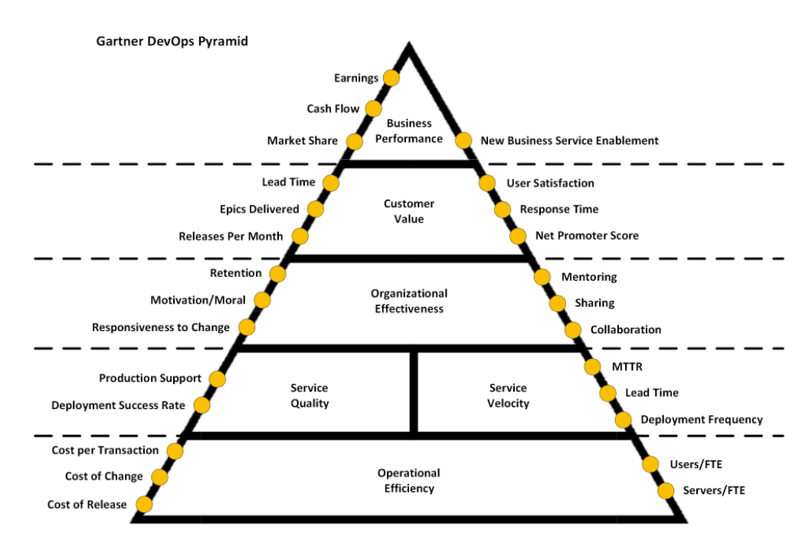

# Metrics

Work in progress to define useful DevOps metrics.
List is in this [file](Metrics.csv).

## Field Explanation

| Field              | Use                                                      | Admissible Values                                                                                                  | Notes                                                    |
|--------------------|----------------------------------------------------------|--------------------------------------------------------------------------------------------------------------------|----------------------------------------------------------|
| Name               | Unique descriptive name                                  | «free text»                                                                                                        |                                                          |
| Description        | Explanation                                              | «free text»                                                                                                        |                                                          |
| Alternate names    | Other names used in the industry                         | «free text»                                                                                                        |                                                          |
| Roll-up dimensions | Applicable aggregate dimensions                          | Code, Plan, CI, Time, Impact, Priority                                                                             |                                                          |
| Category           | Process areas relevant for this metric                   | Speed, Stability, Quality, Efficiency                                                                              |                                                          |
| Type               | Data type                                                | Number, Ratio, Percentage, Time, Money, 1/Time (Frequency), …                                                      |                                                          |
| Phase              | Where applies (pick best)                                | Ideation, Exploration, Design, Iterative development, Deployment, Adoption                                         |                                                          |
| Persona            | Ideal audience for metric                                | Exec, Management, Team                                                                                             | Management = Director, VP; Team includes direct Manager  |
| Sources            | List of tools with data required to calculate the metric | Excel, Rally, Azure DevOps, Jenkins, Sonar, Veracode, XRay, Tenable, Artifactory, Octopus Deploy, ServiceNow       |                                                          |
| Data               | Input data to calculate the metric                       | «list of input fields»                                                                                             |                                                          |
| Data-point Formula | How to calculate a data point for the metric             | «formula»                                                                                                          |                                                          |
| Formulas           | Meaningful calculations over data points                 | «formula»                                                                                                          |                                                          |
| Example            | Commented samples                                        | «free text»                                                                                                        |

## Dimensions

| Dimension          | Values                                     |
|--------------------|--------------------------------------------|
| Code               | Repository -> Application -> Journey       |
| Plan               | User Story -> Feature -> Epic -> Journey   |
| Configuration Item | CI -> Application -> Journey               |
| Time               | Hours -> Days -> Sprint -> Quarter -> Year |
| Impact             | Critical, High, Medium, Low                |
| Priority           | Critical, High, Medium, Low                |
| Category           | Speed, Stability, Quality, Efficiency      |

## Additional ideas

